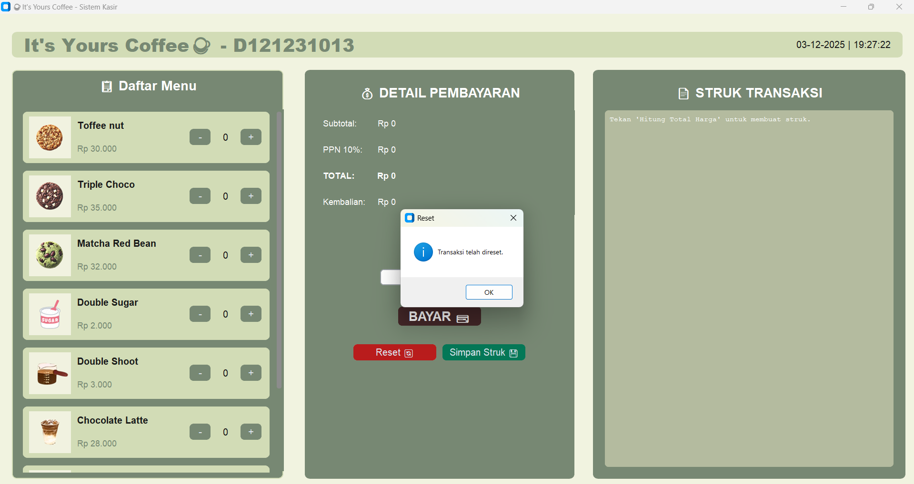
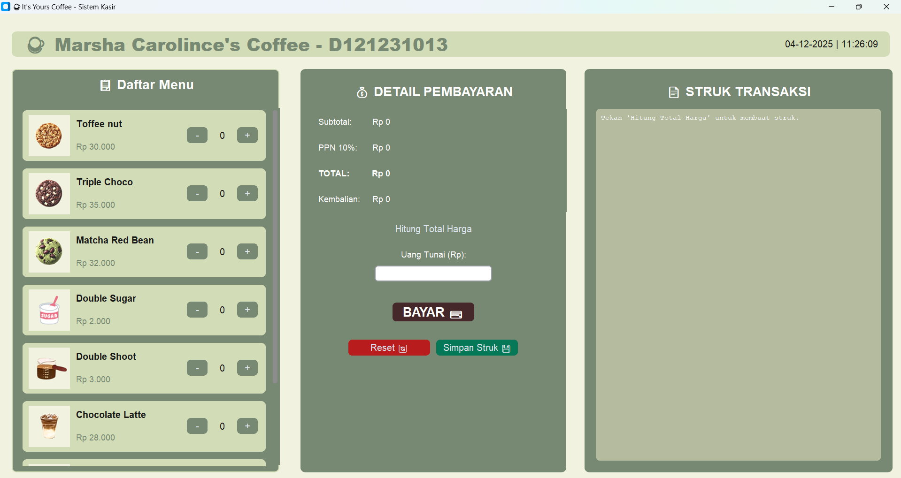

# ☕ Aplikasi GUI Point of Sales (POS) — _It’s Yours Coffee_

Aplikasi **GUI Point of Sales (POS)** _It’s Yours Coffee_ adalah aplikasi kasir sederhana yang dirancang untuk mendukung pengalaman transaksi yang sederhana,
cepat, dan ramah. Dengan alur kerja yang terstruktur, aplikasi ini membantu kasir mencatat pesanan, menghitung total, memproses pembayaran, hingga menyimpan
data transaksi secara efisien. Semua dirancang agar interaksi antara pelanggan dan kasir tetap hangat, tanpa kehilangan akurasi dan kecepatan.
Aplikasi ini menekankan **kecepatan, kemudahan, dan akurasi** dalam pencatatan pesanan dan pengelolaan pembayaran.

Dengan alur kerja yang terstruktur, aplikasi membantu kasir untuk:

- mencatat pesanan pelanggan
- menghitung total secara otomatis
- memproses pembayaran dengan akurat
- menghasilkan dan menyimpan bukti transaksi
- bekerja lebih efisien tanpa mengorbankan interaksi hangat dengan pelanggan

Semua fitur dibuat dengan fokus pada **kemudahan penggunaan (user-friendly)** dan **minim risiko kesalahan**.

## ✨ Filosofi Nama “It’s Yours Coffee”

Nama **“It’s Yours Coffee”** dipilih untuk menonjolkan pesan personal dan emosional—bahwa setiap cangkir kopi dibuat khusus untuk pelanggan.

> **“Dibuat khusus untukmu. Ini milikmu.”**

Nilai yang ingin disampaikan:

- **Personal** — pelanggan merasa dihargai
- **Hangat** — pengalaman transaksi terasa ramah
- **Inklusif** — semua pelanggan dianggap penting
- **Dekat** — membentuk interaksi yang bersahabat

Filosofi ini selaras dengan tujuan aplikasi POS: menjaga proses transaksi tetap **hangat, personal, dan menyenangkan**.

## 🎨 Tema Warna Aplikasi

Tampilan aplikasi dirancang dengan konsep natural, tenang, dan bersih.

| Warna              | Hex Code  | Makna                    | Penggunaan           |
| ------------------ | --------- | ------------------------ | -------------------- |
| Putih krem lembut  | `#F1F3E0` | Bersih, sederhana, ramah | Background utama     |
| Hijau zaitun gelap | `#778873` | Tenang, hangat, alami    | Header, panel menu   |
| Hijau pastel       | `#D2DCB6` | Segar, harmonis          | Tombol, aksen visual |

Pemilihan warna-fusion ini menciptakan nuansa modern dan tidak melelahkan mata bagi kasir.

## 📑 Alur Kerja Aplikasi Kasir

Aplikasi POS bekerja melalui **4 tahap utama**, mulai dari pencatatan pesanan hingga penyimpanan struk.

#### 1️⃣ Input Pesanan

Pada tahap pertama, kasir dapat melakukan Input Pesanan. Ia menandai item daftear meenu yang tersedia sesuai pilihan pelanggan.
Jumlah pesanan dimasukkan melalui Spinbox atau Entry Field. Sistem akan secara otomatis memberikan output Subtotal, PPN, dan Total namun
belum ditampilkan di struk

**Tujuan:**
✔ memastikan seluruh detail pesanan tercatat **lengkap dan akurat**.

#### 2️⃣ Perhitungan Total

Ketika tombol “Hitung Total” ditekan, sistem akan secara otomatis menghitung subtotal berdasarkan harga dan kuantitas (harga × jumlah), 
menambahkan PPN sebesar 10%, lalu menampilkan total pembayaran. Rincian sementara ditampilkan di area struk, lengkap dengan item, 
jumlah, harga satuan, dan total per item. Order summary juga diperbarui dengan subtotal, PPN, dan total.

**Tujuan:**  
✔ menghasilkan perhitungan otomatis dan konsisten  
✔ meminimalkan risiko salah hitung oleh kasir

#### 3️⃣ Pembayaran

Kasir memasukkan jumlah uang dari pelanggan, lalu menekan tombol “Bayar”. Sistem memvalidasi input: jika uang cukup atau lebih,
sistem menghitung kembalian; jika kurang, sistem menampilkan pesan error agar kasir memeriksa kembali. Jika pembayaran berhasil,
kembalian ditampilkan di struk atau pop-up kecil.

**Tujuan:**  
✔ memastikan pembayaran berlangsung **valid dan aman**.

#### 4️⃣ Transaksi Selesai

Setelah input pembayaran berhasil, sistem akan memperbarui struk akhir dengan informasi lengkap, termasuk total bayar, uang pelanggan,
kembalian, serta tanggal dan jam transaksi. Kasir dapat menyimpan struk ke file .txt sederhana dengan menekan tombol “Simpan Struk”.
Setelah itu, tombol “Reset” digunakan untuk menghapus semua input dan membersihkan area struk, sehingga aplikasi siap untuk transaksi berikutnya.

**Tujuan:**  
✔ menghasilkan dokumentasi transaksi yang rapi  
✔ menjaga alur transaksi agar tetap cepat dan berkelanjutan  

## 📁 Struktur Project

project/
├── coffee.py
├── dokumentasi/
└── README.md

## 📌 Hasil Akhir

Untuk memenuhi syarat kelengkapan tugas Pemrograman Visual

> **“Header diganti dengan menggunakan nama dan nim saya.”**

